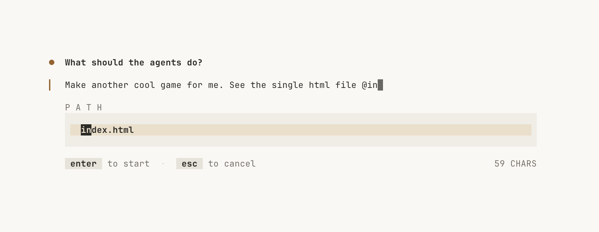
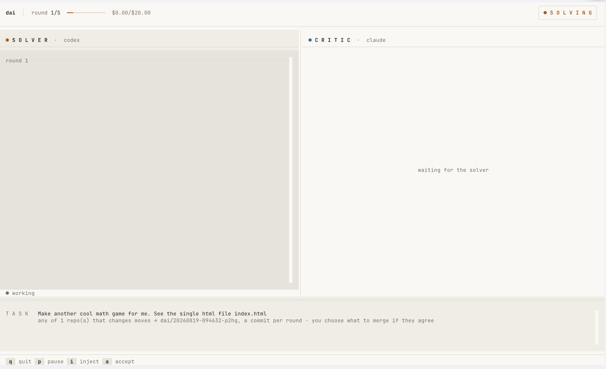

# dai

Two CLI coding agents argue about your task until they agree.

The **solver** does the work in your current directory and signs for it. The **critic**,
on a different engine, reviews the repository rather than that report, and an approval
that names nothing it examined is sent back rather than accepted. The solver answers —
fixing what it accepts, refusing what it doesn't, with reasons — until they agree or the
rounds or budget run out.





## Requirements

- `claude` and `codex` on your `PATH`, both logged in
- Python ≥ 3.11 and [`uv`](https://docs.astral.sh/uv/)

## Quick start

```bash
make install        # create the venv, install deps
make demo           # watch a run without installing the agents or spending anything
make doctor         # check uv / claude / codex are actually installed
make init           # write ~/.config/dai/config.toml (annotated)
make test

make run ARGS="'fill in the empty cells in docs/matrix.md from README.md'"
```

`make help` lists every target.

## Running it

`dai` works on the directory you point it at, not the one it lives in. Install the
command once and the directory you run it in is the context the agents get:

```bash
make install-cli
cd ~/projects/foo && dai "bring the README in line with the code"
```

```bash
dai --rounds 3 --budget 2 "tidy up the error handling in api/"
dai --dry-run "what would you change about the logging setup?"
dai --rigor brutal "make the retry logic actually correct"   # easy·standard·strict·brutal
dai --lang <language> "pon la documentación al día con el código"
dai --solver codex --critic claude "refactor the config loader"
dai --no-tui "regenerate the CLI reference in docs/"
dai --merge "bring the changelog up to date"      # merge back without asking
dai --no-merge "bring the changelog up to date"   # leave it on the run's branch
dai --branch-from current "tidy up the tests"     # branch off where I am, not the trunk
dai --runs                                        # past runs; --show <id> prints one
dai --snapshots                                   # branches those runs committed to
dai --demo                                        # watch a canned run; costs and changes nothing
```

From this checkout instead: `make run-here DIR=~/projects/foo ARGS="'the task'"` or
`uv run dai -C ~/projects/foo "the task"` — every `run` target takes `ARGS`, quoted so
the task stays one argument.

`dai --demo` plays a canned argument through the real screen: the panes stream, the
verdicts land, and the keys all work. The two sides deadlock, you rule on each open
issue, the run carries on from your calls and ends at the merge dialog for you to answer.
The agents are invented and so are the repositories, so it needs neither `claude` nor
`codex` installed, spends nothing, and **writes nothing at all** — no files, no commits,
no transcript. It is the cheapest way to see what a run looks like, and the only way to
see the two decisions that a real run has to earn.

In a repository you care about, start with `--dry-run`: both agents go read-only and
you get their proposals instead. `make smoke` runs a real argument in a throwaway
sandbox — real model calls, so it costs a little.

Exit codes: `0` agreed · `1` did not agree · `2` error.

## TUI keys

Solver on the left, critic on the right, verdicts along the bottom.

| key | |
|---|---|
| `q` | kill the agents and quit — asks first; after the run, just closes |
| `p` | pause / resume |
| `i` | say something to the agents — it outranks both |
| `a` | accept the work as it stands and stop |

On a deadlock the run pauses and asks — issue by issue, showing you the critic's
complaint beside the solver's answer to it. What you uphold goes back to the solver as
binding instructions and what you dismiss leaves the argument for good, so the run
carries on from there and can still end in agreement. `←`/`→` rule the issue under the
cursor, `↑`/`↓` move without ruling, `Enter` continues once every one is decided, and
`Esc` hands whatever is left to the configured default.

The task box and the `i` box take more than one line: `Enter` sends, `Shift+Enter`
breaks the line — or `Ctrl+J` / `Alt+Enter` in terminals that don't speak the kitty
keyboard protocol (Terminal.app among them).

In both boxes `@` opens a file picker scoped to the agents' directory. A bare `@` lists
the top level; typing after it fuzzy-matches the whole tree (`@cmpltn` finds
`src/dai/tui/completion.py`). `↑`/`↓` move, `Enter` or `Tab` picks, `Esc` closes. What
lands in the text is a plain relative path — the `@` never reaches the agents.

`Ctrl+V` takes what the system clipboard holds. A screenshot is saved into the run's
own directory and shows up in the box as `[Img1]`, which becomes the path to that file
in what the agents are sent — so you can copy a screenshot and say "fix the header in
[Img1]". Text on the clipboard is simply inserted.

`dai` asks the terminal what colour it is and wears the matching palette, following a
mid-run theme change on terminals that report one. `--theme dark|light` pins one.

## Config

`~/.config/dai/config.toml`, created by `make init`, every option commented. Defaults:
`claude` solves, `codex` critiques, 5 rounds, $5.00, deadlock goes to the critic,
per-round commits on, and on agreement you are asked what to merge. `rigor` sets how hard
the two lean on each other — the evidence rules hold at every level, it is how far the
critic hunts and how hard the solver defends; above `standard`, expect more rounds and
more spend.

```toml
[critique]
rigor = "standard"            # easy · standard · strict · brutal

[tui]
theme = "auto"                # "auto" follows the terminal; or pin "dark"/"light"
completion_debounce_ms = 80   # delay before the @ list refilters; 0 disables it

[snapshot]
branch_from = "default"       # the trunk; or "current", or a branch name
merge = "ask"                 # on agreement: "ask" · true (just do it) · false (never)
```

## Branches and commits

A repository the agents change is moved onto `dai/<run-id>`, rooted on whatever it
would merge back into — `main`/`master` by default. Each round lands there as an
ordinary commit, and at consensus that base branch is fast-forwarded onto the result,
leaving you on your own branch with the work committed and `git status` clean. Only
consensus merges: a run out of budget or one you killed leaves you on `dai/<run-id>`
instead — as does a deadlock you were not there to rule on.

By default dai asks first. On agreement it shows you every repository that changed —
what it would merge into, how many lines either way, and which files — and merges the
ones you tick; in a plain terminal the same thing is a `[y/N]` question. Nothing is
written until you answer, and every branch survives whichever way you answer. Piped or
redirected, with nobody to ask, nothing is merged and the report says so. `merge = true`
skips the question, `merge = false` never merges at all.

A repository whose base branch moved while the agents were working is refused whatever
you say — the reason names the file that landed there — and stays on `dai/<run-id>`,
yours to merge by hand.

**Repositories nothing changed in are not touched at all.** Whatever was uncommitted
before you started is kept as a `baseline` commit of its own. Not one file on disk is
ever rewritten by dai and none of your hooks fire — which is also why a repository
with anything *staged* is left alone, and says so.

The directory you run in need not be the repository, so the run tells you *which* one
ended up with what:

```bash
dai --snapshots                               # or: make snapshots
git -C <repo> log --oneline <base>..<branch>  # the rounds
git -C <repo> diff <base> <branch>            # everything they changed
git -C <repo> reset --hard <base>             # undo the lot
git -C <repo> branch -D dai/<run-id>          # forget the run
```

`<base>` is printed in the report, and is used rather than `HEAD` because `HEAD` stops
being the right answer the moment anything moves.

## Notes

- **Codex reports tokens, not cost.** Its spend shows as *unmeasured* rather
  than as zero; add `[pricing.codex]` to the config for an estimate.
- **The claude critic reviews by reading (`plan` mode)** and cannot run your tests, so
  its evidence is quoted source rather than command output; the codex critic in
  `read-only` sandbox can run them. Neither is asked to fake the other. To let the
  claude critic run checks too, `critic_args` in the config shows the swap — it trades
  a hard read-only guarantee for a tool denylist.
- **Agents read your files** — use `--dry-run` in repositories you don't trust.

## Licence

MIT — see [LICENSE](LICENSE). Copyright (c) 2026 romus.
